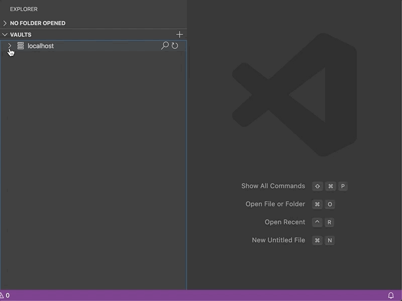
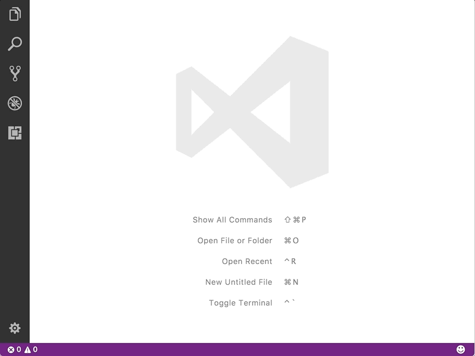
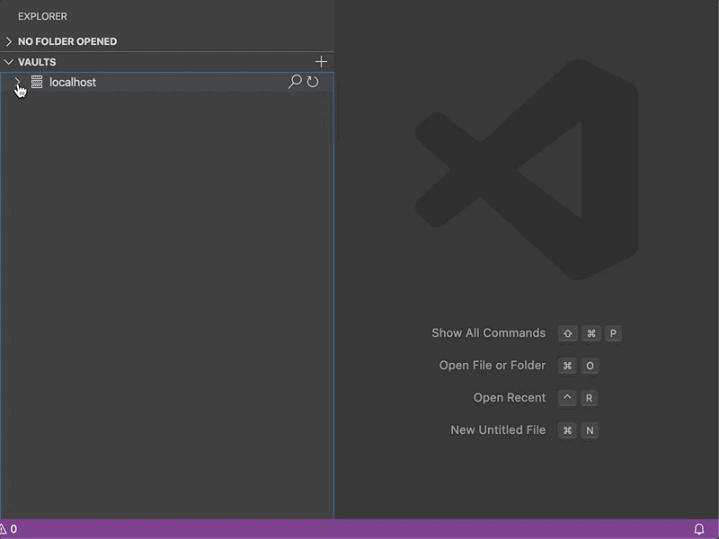

# vscode-vault

[Visual Studio Code](https://code.visualstudio.com/) (VS Code) extension that provides the ability to interact with HashiCorp Vault servers.

## Features

1. [Connecting to a Vault](#connecting-to-a-vault)
2. [Reading and Writing Data](#reading-and-writing-data)
    1. [Key-Value Pairs](#key-value-pairs)
    2. [JSON](#json)
4. [Deleting Paths](#deleting-paths)

### Connecting to a Vault

Prior to reading, writing or deleting paths, a Vault token must be acquired by authenticating against an authentication backend. This extension supports integrated authentication via a GitHub personal access token or via a username and password.

> If your Vault instance uses a self-signed certificate or an enterprise (internal) public key infrastructure, you will need to add your Vault host as a trusted authority.
> See [Extension Settings](#extension-settings) for details.

If your Vault instance does not suport these integrated authentication backends, this extension can reuse a Vault token generated through the Vault CLI.

If authenticating through the CLI or an external process, select the *Native* authentication and provide your Vault token.

### Reading and Writing Data

Much like the Vault CLI, data can be supplied in the form of key-value pairs or as JSON structures.

#### Key-Value Pairs

When writing key-value data to a path, data must be in the form of `key=value`. Multiple attributes can be delimited by spaces and written in the form of `key1=value1 key2=value2`.

When reading key-value data from a path, select an key from the available list. The associated value will then be copied to the clipboard. If thes specified path contains only 1 key, the value associated with that key will be automatically copied to the clipboard.

#### JSON

When writing JSON data to a path, data must be a well-formed JSON object in the form of `{ members }`.

JSON data (or complex data structures, such as a map) is presented through the UI as a flattened object instance to allow for selecting nested values. The type of each value (boolean, number, string) is depected by the icon next to the field name.

### Deleting Paths

## Requirements

TODO

## Extension Settings

The following settings are supported

* `vault.trustedEndpoints` : A collection of authorities (username and port) for which strict SSL checking will be skipped.
* `vault.clipboardTimeout` : A duration (in seconds) after which clipboard contents will be cleared. When set to `0`, clipboard clearing will be disabled. Defaults to `60`.

-----------------------------------------------------------------------------------------------------------

**Enjoy!**
